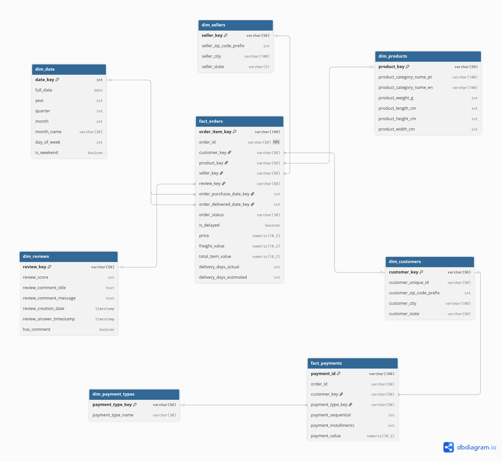

# Olist E-commerce Data Pipeline

Hệ thống Data Pipeline xử lý, làm sạch và mô hình hóa dữ liệu Thương mại điện tử Olist (Brazil) theo chuẩn kiến trúc **Medallion (Bronze ➔ Silver ➔ Gold)**. Dự án sử dụng **PostgreSQL** làm Data Warehouse, **Python CLI** xử lý logic và **Makefile** điều khiển luồng tự động.


---

## Kiến trúc Dữ liệu (Medallion Architecture)

Dữ liệu được tổ chức và biến đổi qua 3 Schemas riêng biệt trong PostgreSQL:

1. **Bronze Layer (Raw Data):**
   - Nạp dữ liệu thô từ các file CSV gốc vào các bảng `bronze.*`.
   - Giữ nguyên định dạng và cấu trúc dữ liệu ban đầu.

2. **Silver Layer (Cleansed & Conformed):**
   - Làm sạch dữ liệu: Chuẩn hóa chuỗi (strip/case), ép kiểu dữ liệu (Timestamp, Numeric), xử lý giá trị `NULL`.
   - Khử trùng lặp (Deduplication) dựa trên mốc thời gian.

3. **Gold Layer (Data Warehouse - Star Schema):**
   - Biến đổi dữ liệu sang mô hình hằng số & sự kiện phục vụ phân tích BI.
   - **Fact Tables:** `fact_orders`, `fact_payments`.
   - **Dimension Tables:** `dim_customers`, `dim_products`, `dim_sellers`, `dim_reviews`, `dim_payment_types`, `dim_date`.



---

## Công nghệ Sử dụng 

- **Ngôn ngữ:** Python 
- **Thư viện xử lý:** Pandas, SQLAlchemy, Psycopg2
- **Cơ sở dữ liệu:** PostgreSQL 
- **Công cụ điều khiển:** Make (Linux CLI)
- **Báo cáo & BI:** Power BI

---

## Vận hành Pipeline 

Thực hiện theo các bước dưới đây để khởi tạo và vận hành toàn bộ Data Pipeline.

### 1. Tải dữ liệu Olist

Tải bộ dữ liệu từ Kaggle tại đường dẫn sau:

https://www.kaggle.com/datasets/olistbr/brazilian-ecommerce

Sau khi tải về, đặt toàn bộ file dữ liệu vào thư mục `data/` rồi giải nén tại đó. Thư mục `data/` sẽ chứa các file CSV nguồn dùng cho pipeline.


### 2. Khởi tạo môi trường ảo và cài đặt thư viện

Tạo môi trường ảo `env` và cài các thư viện cần thiết:

```bash
python3 -m venv env
source env/bin/activate
pip install --upgrade pip
pip install -r requirements.txt
```

### 3. Cài đặt PostgreSQL và tạo database

Cài đặt PostgreSQL trên máy của bạn, sau đó tạo database tên `olist`.

Ví dụ với `psql`:

```sql
CREATE DATABASE olist;
```

### 4. Tạo file cấu hình `.env`

Tạo file `.env` ở thư mục gốc của dự án và khai báo các thông tin kết nối cơ sở dữ liệu:

```env
POSTGRES_USER=your_user
POSTGRES_PASSWORD=your_password
POSTGRES_HOST=localhost
POSTGRES_PORT=5432
POSTGRES_DB=olist
```

### 5. Vận hành Data Pipeline

Sau khi đã có dữ liệu, môi trường ảo và cấu hình database, chạy toàn bộ pipeline bằng lệnh:

```bash
make run-all
```

Lệnh này sẽ lần lượt:

1. Tạo các bảng ở các tầng Bronze, Silver, Gold.
2. Nạp dữ liệu từ CSV vào Bronze.
3. Chuyển đổi dữ liệu từ Bronze sang Silver.
4. Biến đổi dữ liệu từ Silver sang Gold.

### Lưu ý
- Đảm bảo PostgreSQL đang chạy trước khi thực thi `make run-all`.
- Nếu cần tạo lại schema từ đầu, có thể chạy riêng `make init`.